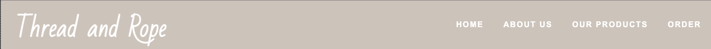
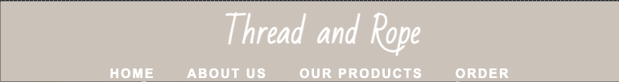
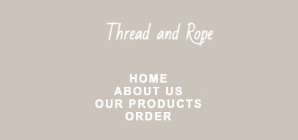
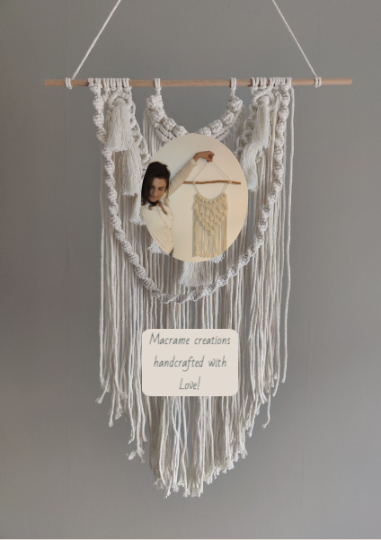
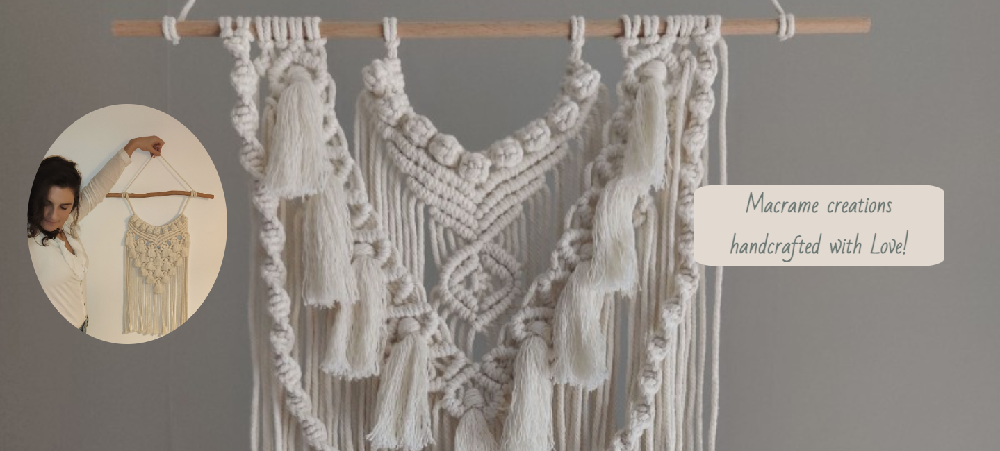
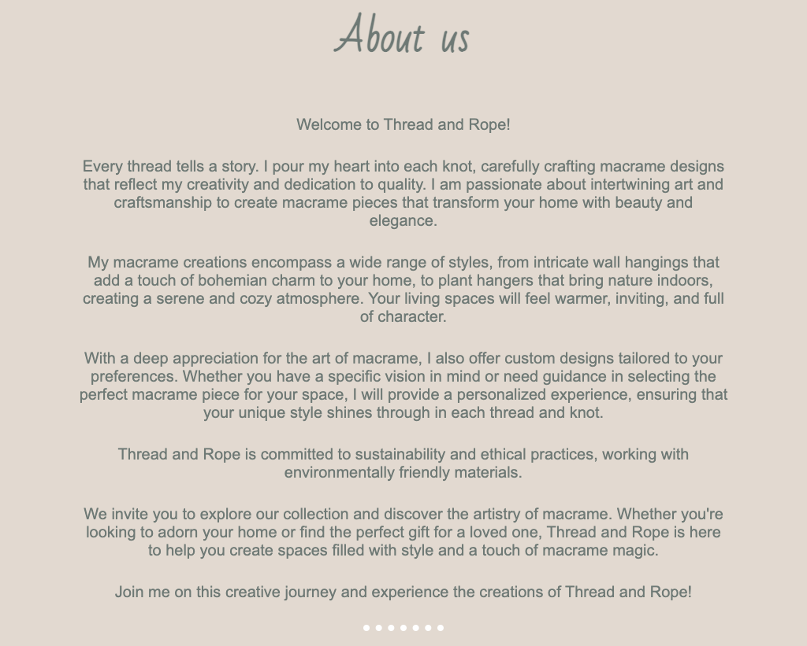

# _Thread and Rope_

---

[Thread and Rope](https://johns-costa.github.io/threadandrope/) is a website for for anyone that want to make improve their home or office with a beautiful hangings macrames.

Here the parents can get required information about the school, become familiar with its staff and take a closer look at the facilities and environment.

---

## Technologies used

- HTML
- CSS
- Font Awesome icons
- Google fonts

---

## User stories

- As a first time visitor, I want to understand of the website, so i can know about the products produced and see their potential.
- As a first time visitor, I want to be able to easily navigate through the website, so I can find the information I am looking for.
- As a first time visitor, I want to see the information about the each individual product and its price.
- As a user, I want the products to be clearly visible in the products section.
- As a user, I want to be able to be directed to a purchase form in order to make ease to order products.
- As a mobile device and tablet user, I want the website to be responsive, so I can use my phone or tablet make purchases.

---

## Features

### Home page

- ##### Navigation

  - Positioned at the top of the page.
  - Contains logo of the macrame company at the left corner.
  - At the right side there are navigation links:
    - Home - leads to the home page.
    - About us - leads to the about us section.
    - Our products - leads to the our products section.
    - Order - leads to the order form page.
  - The links have animated hover effect.
  - The navigation is clear and easy to understand for the user.
  - The navigation bar is responsive and appears in form of a stack menu on mobile devices.

  
  
  

---

- ##### Hero section

  - Hero section have an animated background image.
  - Hero section shows the moto text block the right side of the screen:

    - It tells the user what the company is all about.

  - Hero section shows the side of the screen:

    - It shows the potential of the work that can be done by the macrame creator.
      

  - The profile picture and the moto align in the center when on mobile phone or tablet

  

---

- ##### About Us section
  - About us section provides information about the macrame company.
  - About us section tells the user how the products are made.
  - About us incentivises the user to buy the products.
    

---
