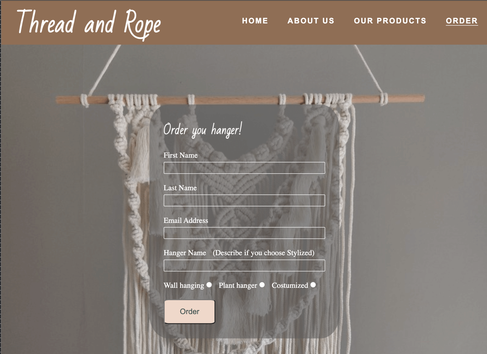
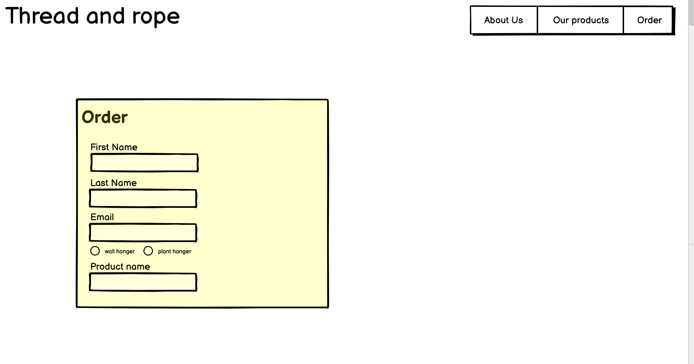

# _Thread and Rope_

---

[Thread and Rope](https://johns-costa.github.io/threadandrope/) is a website for for anyone that want to make improve their home or office with a beautiful hangings macrames.

Here the parents can get required information about the school, become familiar with its staff and take a closer look at the facilities and environment.

---

## Technologies used

- [HTML](https://en.wikipedia.org/wiki/HTML)
- [CSS](https://en.wikipedia.org/wiki/CSS)
- [Font Awesome icons](https://fontawesome.com/)
- [Google fonts](https://fonts.google.com/)

---

## User stories

- As a first time visitor, I want to understand of the website, so i can know about the products produced and see their potential.
- As a first time visitor, I want to be able to easily navigate through the website, so I can find the information I am looking for.
- As a first time visitor, I want to see the information about the each individual product and its price, so I can get atracted to the producs and decide quickly what to buy.
- As a user, I want the products to be clearly visible in the products section, so I can know my options and what is new.
- As a user, I want to be able to be directed to a purchase form in order when pressing the product, so I don't loose time going through the website.
- As a mobile device and tablet user, I want the website to be responsive, so I can use my phone or tablet to make purchases.

---

## Features

### Home page

- ##### Navigation

  - Positioned at the top of the page.
  - Contains logo of the macrame company at the left corner.
  - At the right side there are navigation links:
    - Home - leads to the home page.
    - About us - leads to the about us section.
    - Our products - leads to the our products section.
    - Order - leads to the order form page.
  - The links have animated hover effect.
  - The navigation is clear and easy to understand for the user.
  - The navigation bar is responsive and appears in form of a stack menu on mobile devices.

  
  
  

---

- ##### Hero section

  - Hero section have an animated background image.
  - Hero section shows the moto text block the right side of the screen:

    - It tells the user what the company is all about.

  - Hero section shows the side of the screen:

    - It shows the potential of the work that can be done by the macrame creator.

  - The profile picture and the moto align in the center when on mobile phone or tablet

  

  

---

- ##### About Us section
  - About us section provides information about the macrame company.
  - About us section tells the user how the products are made.
  - About us incentivises the user to buy the products.
    

---

- ##### Our Products

  - This sections contains images of the different products the company sells
  - It is devided into two columns (shown horizontally on desktop and vertically on mobile):
    - Wall hangings
    - Plant hangers
  - When hovered (or pressed on mobile version) on each image it shows:
    - hanging name.
    - hanging price.
    - order button, that leads to the order form when pressed.

  
  

---

- ##### Footer

  - Footer contains social media links that open in a new tab.
  - Under the social media links there is a copyright sign with my github link.

  

---

- #### Order page

  - This page has an Order form:
    - All text input fields are customized.
    - The radio buttons are customized as well to look the same way in every browser.
    - The submit button is animated on hover.
  - The page is responsive and look good on all common screen sizes.
  - Submitting the form leads to the hidden thank you response page that contains "thank you" message.

  
  

---

### Testing

- I tested that the website works in different browsers: Chrome, Firefox, Safari.
- I used devtools and [Responsive Website Design Tester](https://responsivedesignchecker.com/) to confirm that the website is responsive, looks and functions as it supposed to on all standard screen sizes.
- I manualy tested all the links and confirmed that all of them work and lead where they suppose to lead:

#### Manual testing

| feature | action | expected result | tested | passed | comments |
| --- | --- | --- | --- | --- | --- |
| Navbar | | | | | |
| Home | Click on the "HOME" link | The user is redirected to the main page | Yes | Yes | - |
| About us | Click on the "ABOUT US" link | The user is redirected to the About us section | Yes | Yes | - |
| Our products | Click on the "OUR PRODUCTS" link | The user is redirected to the Our products section | Yes | Yes | - |
| Order | Click on the "ORDER" link | The user is redirected to the Order form page | Yes | Yes | - |
| Footer | | | | | |
| Facebook icon in the footer | Click on the Facebook icon | The user is redirected to the Facebook page | Yes | Yes | - |
| Twitter icon in the footer | Click on the Twitter icon | The user is redirected to the Twitter page | Yes | Yes | - |
| YouTube icon in the footer | Click on the YouTube icon | The user is redirected to the YouTube page | Yes | Yes | - |
| Instagram icon in the footer | Click on the Instagram icon | The user is redirected to the Instagram page | Yes | Yes | - |
| Home page | | | | | |
| Order | Click on the "ORDER" link in each products picture | The user is redirected to the Order form page | Yes | Yes | - |
| Order page | | | | | |
| First name input | Enter the first name | The first name is entered | Yes | Yes | If user doesn't enter the first name, the error message appears |
| Last name input | Enter the last name | The last name is entered | Yes | Yes | If user doesn't enter the last name, the error message appears |
| Email input | Enter the email | The email is entered | Yes | Yes | If user doesn't enter the email, the error message appears. If user enters not valid email, the error message appears |
| Hanger Name (Describe if you choose Stylized) | Enter the hanger name | The hanger name is entered | Yes | Yes | If user doesn't enter the hanger name, the error message appears |
| Wall hanging, Plant hanger and Costumized  checkbox | Click on the checkbox | The checkbox is checked | Yes | Yes | If the user doesn't check one of the boxes, the error message appears |
| "Submit" button | Click on the "Submit" button | The user is redirected to the thank you page | Yes | Yes | - |
| Thank you page | | | | | |
| Back to Home page | Click on the "Back to Home page" button | The user is redirected to the home page | Yes | Yes | - |

---

### Bugs

- ##### Solved bugs
  - I used viewheight units at the order page at first and found out that on devices the window on the browser had a small height, the form would be cut
  - I fixed it by using the css property min-height, that prevents the page to be squished on all screens.
  ***
  - I had a lot of back and forward to make the images on the "our products" to show a hover message when on desktop mode and only show a message when pressed on mobile devices that use touch screen.
  - I fixed it by desabeling the hover and enabeling the text to show when pressed.
  ***
  - After fixing the previous issue I noticed that the the page would scroll up to the text area instead cutting part of the image that was just pressed
  - I fixed it by using the css property scroll-margin-top, which makes the scroll finish before the actual achor tag.
- ##### Unsolved bugs
  - None.

---

### Validator testing

- ##### HTML
  - No errors or warnings were found when passing through the official W3C validator.
- ##### CSS
  - No errors or warnings were found when passing through the official W3C (Jigsaw) validator.
- ##### Accessibility and performance
  - Using lighthouse in devtools I confirmed that the website is performing well, accessible and colors and fonts chosen are readable. Both in desktop (first image) and in mobile mode (second image).
    
    

---

### Deployment

- The website was deployed to GitHub pages and can be accessed by the link: [Thread and Rope](https://johns-costa.github.io/threadandrope).

---

### Credits

- ##### Content

  - The code to make social media links and the form template were partially from the Code Institute, Love Running project, and modified to fit my website.

- ##### Media
  - All the images for the website were taken by me.

---

#### Wireframes

