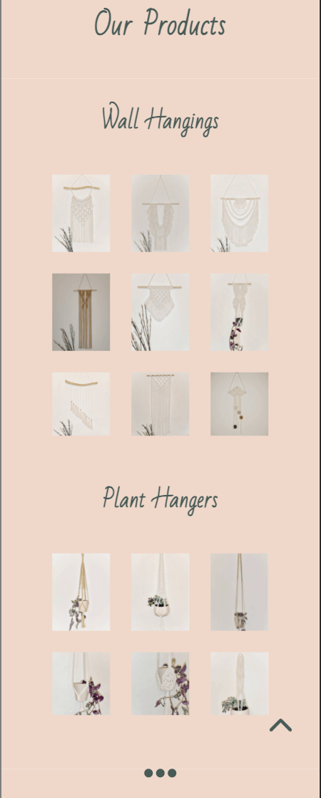
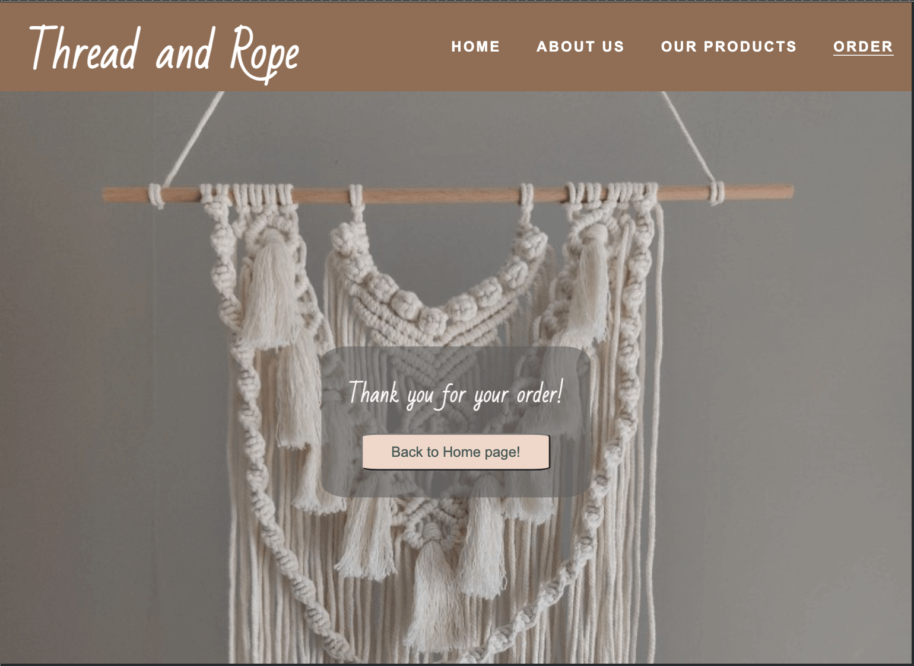

# _Thread and Rope_

---

[Thread and Rope](https://johns-costa.github.io/threadandrope/) is a website for for anyone that want to make improve their home or office with a beautiful hangings macrames.

Here the parents can get required information about the school, become familiar with its staff and take a closer look at the facilities and environment.

---

## Technologies used

- HTML
- CSS
- Font Awesome icons
- Google fonts

---

## User stories

- As a first time visitor, I want to understand of the website, so i can know about the products produced and see their potential.
- As a first time visitor, I want to be able to easily navigate through the website, so I can find the information I am looking for.
- As a first time visitor, I want to see the information about the each individual product and its price.
- As a user, I want the products to be clearly visible in the products section.
- As a user, I want to be able to be directed to a purchase form in order to make ease to order products.
- As a mobile device and tablet user, I want the website to be responsive, so I can use my phone or tablet make purchases.

---

## Features

### Home page

- ##### Navigation

  - Positioned at the top of the page.
  - Contains logo of the macrame company at the left corner.
  - At the right side there are navigation links:
    - Home - leads to the home page.
    - About us - leads to the about us section.
    - Our products - leads to the our products section.
    - Order - leads to the order form page.
  - The links have animated hover effect.
  - The navigation is clear and easy to understand for the user.
  - The navigation bar is responsive and appears in form of a stack menu on mobile devices.

  
  
  

---

- ##### Hero section

  - Hero section have an animated background image.
  - Hero section shows the moto text block the right side of the screen:

    - It tells the user what the company is all about.

  - Hero section shows the side of the screen:

    - It shows the potential of the work that can be done by the macrame creator.

  - The profile picture and the moto align in the center when on mobile phone or tablet

  

  

---

- ##### About Us section
  - About us section provides information about the macrame company.
  - About us section tells the user how the products are made.
  - About us incentivises the user to buy the products.
    

---

- ##### Our Products

  - This sections contains images of the different products the company sells
  - It is devided into two columns (shown horizontally on desktop and vertically on mobile):
    - Wall hangings
    - Plant hangers
  - When hovered (or pressed on mobile version) on each image it shows:
    - hanging name.
    - hanging price.
    - order button, that leads to the order form when pressed.

  
  

---

- ##### Footer

  - Footer contains social media links that open in a new tab.
  - Under the social media links there is a copyright sign with my github link.

  

---

- #### Order page

  - This page has am Order form:
    - All text input fields are customized.
    - The radio buttons are customized as well to look the same way in every browser.
    - The submit button is animated on hover.
  - The page is responsive and look good on all common screen sizes.
  - Submitting the form leads to the hidden thank you response page that contains "thank you" message.

  
  

---
### Testing

- I tested that the website works in different browsers: Chrome, Firefox, Safari.
- I used devtools and [Responsive Website Design Tester](https://responsivedesignchecker.com/) to confirm that the website is responsive, looks and functions as it supposed to on all standard screen sizes.
- I tested all the links and confirmed that all of them work and lead where they suppose to lead.

### Bugs

- ##### Solved bugs
  - I used viewheight units at the contact page at first and found out that on mobile devices when you click into the text input field and the keyboard appears, it squished all the page and made it look ugly.
  - I fixed it by using the css property min-height, that prevents the page to be squished on all screens.
  ***
  - Another bug appeared in the landscape mode on mobile devices in the Meet Our Staff section. Teacher cards looked broken because it tried to show the section using media query breakpoint for small desktop screens.
  - I fixed it by adding another breakpoint specifically for landscape mode on mobile devices.
  ***
- ##### Unsolved bugs
  - None.